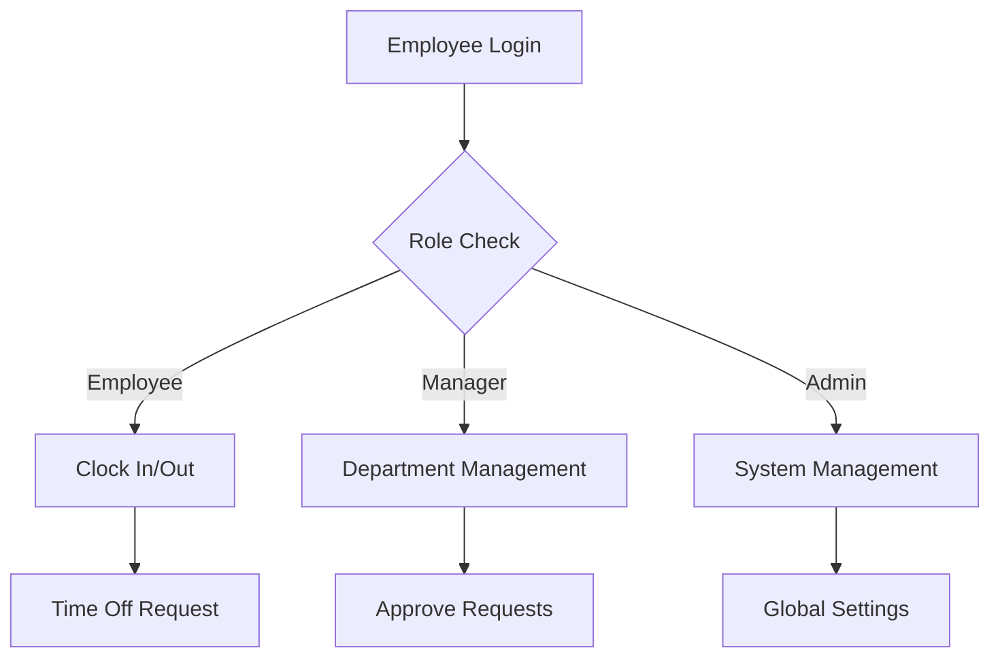

# TimeClock Features Documentation

## 🔐 Authentication & Authorization

### User Authentication
- Email/password login with validation
- Two-factor authentication support
- Social login integration
- Session management
- Password reset functionality

### Role-Based Access Control
- Admin: Full system access
- Manager: Department-level control
- Employee: Basic time tracking

## ⏰ Time Management

### Flow

### Clock In/Out
- Time tracking start/stop
- Break management
- Overtime tracking
- Location verification
- Status indicators
- Real-time updates

### Time Off Management
- Request submission
- Multi-department requests
- Approval workflow
- Calendar integration
- Status tracking

## 👥 Department Management

### Structure
- Department creation/editing
- Employee assignment
- Role management
- Budget tracking
- Analytics

## 👤 Employee Management

### Core Features
- Profile management
- Rate settings
- Position assignments
- Department transfers

### Time Tracking
- Hours worked
- Overtime calculation
- Break management
- Attendance records

## 📅 Scheduling

### Features
- Shift creation
- Weekly schedules
- Conflict detection
- Time off integration
- Calendar view

## 📊 Reports & Analytics

### Department Reports
- Cost analysis
- Hours summary
- Employee statistics
- Time off patterns

### Employee Reports
- Hours worked
- Attendance
- Time off history
- Performance metrics

## 🛠 Technical Implementation

### Backend
- Next.js 14 App Router
- PostgreSQL database
- Prisma ORM
- Server Actions

### Frontend
- React Server Components
- TailwindCSS
- shadcn/ui components
- Framer Motion

## 🔄 User Flows

### Employee Flow
- Login with credentials
- View dashboard
- Clock in/out
- Submit time off requests
- View schedule

### Manager Flow
- Department overview
- Employee management
- Schedule creation
- Time off approvals
- Report generation

### Admin Flow
- System configuration
- Department creation
- User management
- Global reports
- Settings control

## 📱 Mobile Responsiveness
- Responsive design
- Touch-friendly interfaces
- Mobile-optimized views
- PWA support

## 🔜 Future Enhancements
- Mobile app
- API integrations
- Advanced analytics
- Payroll integration
- Leave accrual
- Holiday management